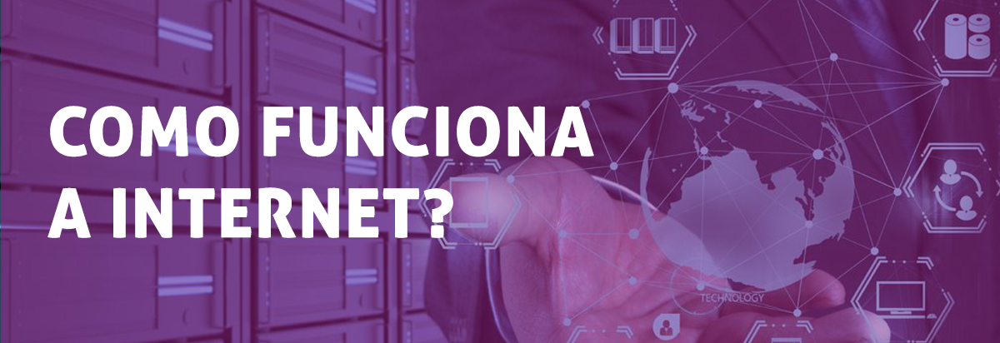
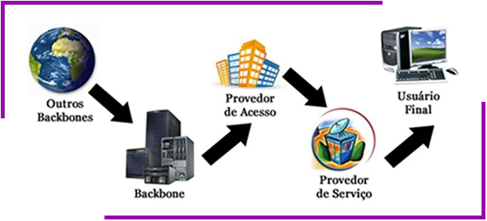

### exercicio01-giselle

# **O QUE É A INTERNET?**

### Ao falarmos sobre Internet, geralmente lembramos que ela é “uma rede de computadores”. Podemos até dizer que sim, mas para compreender como a Internet chega na sua casa vamos imaginar que ela é uma pequena rede conectada a outras redes (maiores) de computadores. Sendo assim, não há um dono da Internet, nem uma empresa que a controle, mas sim um grupo de várias redes interligadas.

# **O CAMINHO DA INTERNET**

### Este caminho passa por quatro passos principais, sempre identificados por um endereço de IP: *o Backbone, o provedor de acesso, o provedor de serviço e o usuário final.*

## *BACKBONES*

### O ponto inicial de referência da Internet, o setor que interliga todos os pontos da rede: o backbone. Estes backbones são pontos das redes que compõem o núcleo das redes de Internet. São pontos-chave da Internet que distribuem pelas redes as informações baseadas na tecnologia TCP/IP. Existem poucos backbones espalhados pelo mundo, e estes são os responsáveis por distribuir o acesso mundial para a rede de Internet.

## *PROVEDOR DE ACESSO*

### A partir dos backbones, a Internet passa para uma nova etapa, quando o seu sinal chega aos provedores de acesso - as empresas que contratam o sinal de backbones para distribuir aos seus usuários. Os provedores de acesso são, em geral, empresas ligadas ao setor de telecomunicações, ou até mesmo as próprias companhias telefônicas, que fornecem o acesso à Internet por meio de planos acordados com seus usuários.

## *PROVEDOR DE SERVIÇO*

### Estes dados de Internet que trafegarão na rede necessitam de um meio para o seu transporte até os usuários, e são as empresas provedoras de serviço as responsáveis por este papel. Estas empresas recebem os dados do provedor de acesso e distribuem aos usuários por variados meios, seja por linha telefônica, fibra ótica ou via rádio (por tecnologia sem fio). Estas empresas devem sempre ser regulamentadas pela Anatel e podem ser prestadores de serviço de rede, companhias telefônicas e empresas de telecomunicações.

## *USUÁRIO FINAL*

### Este pode parecer o passo final do caminho percorrido pela Internet, mas na verdade não é. Ao chegar no usuário final o sinal de Internet passa a repetir todo o caminho novamente, porém na forma inversa, já que você, como usuário final, também envia sinais - com as suas requisições - para a Internet. Os dados enviados pelos usuários são transportados pelo provedor de serviço, enviados para o provedor de acesso e chegam novamente ao backbone. A partir do backbone, o processo segue novamente o mesmo caminho inicial até o próximo destino, que pode ser, por exemplo, o arquivo do CD que você está querendo fazer download, de qualquer lugar pode ser até de outro país.

#### **LEIA MAIS** <https://www.techtudo.com.br/noticias/noticia/2011/07/como-internet-chega-na-sua-casa.html> *Acesso em 14/08/2020*

